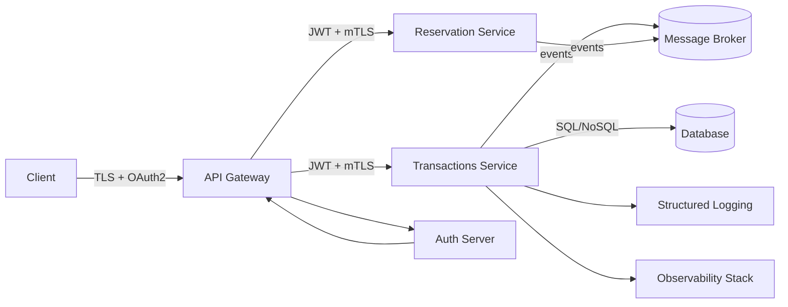

# Secure Financial Transaction Microservice (v0.1.0)

This repository is a **mini technical whitepaper + reference implementation** for a security-first financial microservice built with NestJS. It demonstrates how to compose zero-trust controls, auditable workflows, and production-ready scaffolding in a compact codebase.

## Problem Statement
Financial transaction systems must process sensitive money flows while resisting credential theft, insider misuse, replay attempts, and supply-chain risk. We need a baseline blueprint that shows how to wire authentication, authorization, auditability, and operational safety into every hop.

## Why Secure Distributed Systems Matter
- Lateral movement is the norm in microservice architectures; implicit trust between services becomes an attack surface.
- Regulatory expectations (SOX, PCI DSS, SOC2) demand traceable controls around identity, integrity, and availability.
- Downtime or double-spend bugs carry real financial loss and reputational damage.

## Financial Systems Use Case
- Accept payment instructions, enforce roles, and emit immutable audit records.
- Support service-to-service calls from risk engines, fraud detectors, and ledgers via zero-trust mesh tokens.
- Provide hooks for persistence, eventing, and compliance evidence.

## Security Architecture Principles
- **Deny-by-default**: every route is protected unless explicitly marked `@Public()`.
- **Identity everywhere**: JWT for users, shared-secret or mTLS for services.
- **Least privilege**: RBAC on controllers; mesh identities bypass only role checks when explicitly service-scope.
- **Verifiable state**: audit trail on every request result (success/failure).
- **Secure-by-config**: strict env validation; app refuses to boot with incomplete secrets.

## Zero-Trust Implementation
- Global guard enforces either OAuth2 JWT (RS/ES/PS256) or `x-service-token` for mesh calls.
- Optional mTLS listener when `TLS_CERT_PATH`/`TLS_KEY_PATH` are provided.
- Global Helmet + validation pipe to reduce surface for common exploits.

## Audit Logging
- `AuditInterceptor` writes JSON lines to `logs/audit.log` with actor, action, resource, status, roles, IP, and trace id.
- Works on both success and error paths for forensic completeness.

## OAuth2 / RBAC
- JWT validation pinned to `iss` and `aud` from config.
- Roles decorator (`@Roles(...)`) and guard enforce fine-grained access (`payments:write`, `payments:read`).

## Compliance Considerations
- Boot-time config validation ensures secrets are present (reduces misconfig drift).
- Structured audit log supports PCI/SOX evidence; extend to remote log sinks for immutability.
- mTLS + JWT layered auth aligns with least privilege and segregation-of-duties.

## Scalability & Resilience Design
- Stateless app; ready for horizontal scaling behind a gateway or service mesh.
- In-memory ledger stub is replaceable with ACID/append-only store plus idempotency keys.
- Hooks for circuit breakers, retries, and outbox/event streaming for eventual consistency.

## Architecture (Conceptual)



**Threat Model**
- Adversaries may intercept traffic, reuse stolen tokens, replay requests, or laterally move across services.
- Controls: TLS everywhere, optional mTLS, JWT signature/claims validation, strict role checks, audit trail, and input validation.

**Security Controls**
- Zero-trust guard for every route; public endpoints explicitly marked.
- JWT verification (issuer/audience/algorithms), shared-secret mesh token, optional mTLS termination.
- RBAC, Helmet, validation pipe, and structured audit logs.

**Failure Handling**
- Config fails closed (missing secrets => boot abort).
- Per-request validation errors return 400 before business logic.
- Audit interceptor logs both success and failure for investigation.
- Designed to add circuit breakers/timeouts when downstreams are wired.

## Security Features (current)
- Mutual TLS: supported when cert/key paths provided.
- JWT validation: RS/ES/PS256, issuer + audience pinned.
- Role-based authorization: controller-level `@Roles`.
- Rate limiting: **TODO** (install nest rate-limiter or gateway policy).
- Input validation: class-validator DTOs + global `ValidationPipe`.
- Event-driven integrity checks: **TODO** (wire broker + idempotent handlers).
- Idempotency patterns: **TODO** (idempotency keys + dedupe store).
- Circuit breaker: **TODO** (e.g., opossum or mesh policy).

## Key Endpoints
- `GET /api/health` (public)
- `GET /api/test` (public)
- `POST /api/transactions` (roles: `payments:write`)
- `GET /api/transactions/:id` (roles: `payments:read`)

Service-to-service calls: `x-service-token: <SERVICE_MESH_SHARED_SECRET>` plus optional `x-service-name`.

## Run Locally
```bash
pnpm install
cp .env.example .env   # fill in JWT_PUBLIC_KEY + secrets
pnpm run start:dev
```
Base path: `http://localhost:3000/api`

## Container Image
```bash
docker build -t secure-tx .
docker run -p 3000:3000 --env-file .env secure-tx
```
Provide `TLS_CERT_PATH` and `TLS_KEY_PATH` inside the container for mTLS listener.

## Topics
distributed-systems · microservices · zero-trust · fintech-architecture · secure-backend · typescript · kubernetes-ready

## Release Notes
See `RELEASE_NOTES.md` for version history (current: v0.1.0).

## Next Steps
- Add persistence (Mongo/Postgres) with idempotency keys.
- Wire distributed tracing (OpenTelemetry) and metrics.
- Add e2e security tests, contract tests for mesh calls, and rate limiting.
